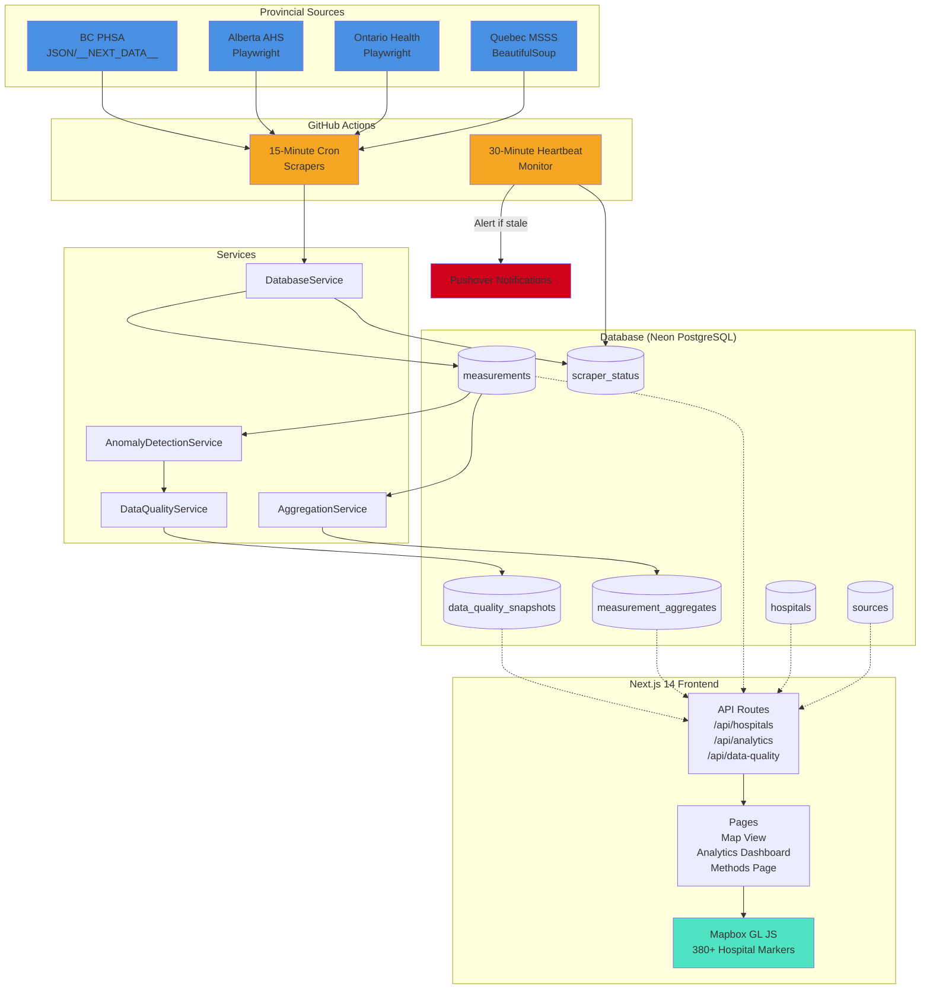

# WaitTime Canada

> A clinically defensible Health Systems Observatory for Canadian emergency department wait-time methodology and data quality.

[](https://github.com/jerdaw/waittimecanada/actions/workflows/frontend-ci.yml)
[](https://github.com/jerdaw/waittimecanada/actions/workflows/scraper-ci.yml)
[](https://github.com/jerdaw/waittimecanada/actions/workflows/production-readiness.yml)
[](https://opensource.org/licenses/MIT)
[](https://www.python.org/downloads/)
[](https://nodejs.org/)
[](https://github.com/jerdaw/waittimecanada)
[](https://github.com/jerdaw/waittimecanada)
[](https://zenodo.org/badge/latestdoi/1146067459)

---

## 📊 Overview

**WaitTime Canada is not a simple wait-time leaderboard.** It's a comprehensive health systems observatory that audits and exposes methodological inconsistencies in Canadian emergency department reporting across provinces.

### Current Coverage

- **4 Provinces:** Quebec, Ontario, Alberta, British Columbia
- **380+ Hospitals:** Real-time monitoring across all regions
- **15-Minute Updates:** Automated data collection via GitHub Actions
- **First-in-Canada:** Real-time ED stretcher occupancy visualization (Quebec)

### Why This Matters

Provincial health authorities report ER wait times using **fundamentally different methodologies**:
- Quebec starts the clock at **REGISTRATION** (administrative check-in)
- Ontario starts at **TRIAGE** (clinical assessment)
- Different statistical measures (P90 vs rolling averages)
- Different patient populations (all vs mid-acuity)

**Direct comparison without methodology awareness is clinically misleading.** This observatory makes those differences transparent.

---

## ✨ Key Features

### 🎯 Methodology Transparency
- **Ontology-Based Architecture:** Every measurement tagged with start_event, end_event, statistic_type, patient_scope
- **Divergence Warnings:** Automatic alerts when comparing incompatible metrics
- **Comparability Matrix:** Visual display of cross-province methodology alignment
- **Deep Linking:** Share specific hospital comparisons with methodology context

### 📈 Data Quality & Monitoring
- **Anomaly Detection:** Automated flagging of suspicious measurements
- **Data Quality Dashboard:** Real-time visibility into scraper health, measurement counts, staleness
- **Heartbeat Monitoring:** Dead Man's Switch alerts via Pushover if data becomes stale
- **Methodology Change Detection:** Tracks when provincial reporting methods change

### 🏥 Real-Time Occupancy (Quebec)
- **First-in-Canada:** Stretcher occupancy percentage visualization
- **Color-Coded Indicators:**
  - 🟢 Green (<90%): Below capacity
  - 🟡 Yellow (90-110%): Near capacity
  - 🔴 Red (>110%): Overcrowded with pulse animation
- **Clinical Context:** >100% indicates overcrowding and potential extended waits

### 📊 Analytics & Benchmarking
- **Peer Benchmarking:** Hospital performance vs regional/provincial averages
- **Temporal Patterns:** Hour-of-day, day-of-week, monthly trend analysis
- **Regional Intelligence:** 15 health regions mapped with analytics segmentation
- **System Trends:** Province-wide performance tracking with 90d/6m/1y views

### 🗺️ Interactive Map
- **Mapbox Integration:** Geographic visualization of all hospitals
- **Live Data Indicators:** Real-time updates highlighted
- **Distance Calculation:** User location-based sorting
- **Cluster Markers:** Efficient rendering of 380+ locations

### 📤 Data Export
- **Citation-Ready:** CSV/JSON export with methodology metadata
- **Granularity Control:** Raw measurements, hourly, daily, weekly, or monthly aggregates
- **Research-Grade:** Full audit trail with payload hashing and parser versioning

### 🔍 Access & Equity Insights
- **Access Burden Estimator:** Fuel + parking cost calculations for patient decision-making
- **Provincial Gas Price Awareness:** ON $1.55/L, QC $1.60/L, BC $1.75/L
- **Distance-Based Analysis:** Nearest hospital identification within radius
- **Equity Layer Scaffold:** Foundation for census tract income overlays (future)

---

## 🏗️ Technical Architecture



### Backend
- **Language:** Python 3.12+
- **Testing:** pytest with 375+ tests, 77% code coverage
- **Scrapers:** 4 provincial scrapers (BeautifulSoup, Playwright, JSON extraction)
- **Database:** Neon PostgreSQL 17 with 9 tables, strict ontology constraints
- **Services:**
  - DatabaseService, AggregationService, DataQualityService
  - AnomalyDetectionService, MethodologyChangeDetector
  - GeocodingService (Nominatim), HeartbeatService
- **CLI Tools:** Scraper runner, database cleanup, seeding, aggregation, region mapping

### Frontend
- **Framework:** Next.js 14 App Router + TypeScript
- **Testing:** Vitest with 287 tests (285 passing)
- **Mapping:** Mapbox GL JS
- **Components:** 30+ React components with comprehensive test coverage
- **API Routes:** 15+ endpoints for hospitals, comparisons, analytics, data quality
- **Pages:** Home (map + list), /data-quality, /analytics, /methods, /about

### Database Schema (9 Tables)
- `sources` - Provincial data source metadata
- `hospitals` - Facility metadata with verification workflow
- `measurements` - Audit log with ontology tags (payload hashing, not full HTML)
- `scraper_status` - Heartbeat monitoring
- `measurement_aggregates` - Permanent statistical summaries (hourly/daily/weekly/monthly)
- `data_quality_snapshots` - Daily scraper reliability metrics
- `methodology_change_events` - Detected methodology shifts
- `regions` - Province region metadata for analytics
- `hospital_regions` - Hospital-to-region mappings

### Automation
- **GitHub Actions:** Scrapers run every 15 minutes, heartbeat checks every 30 minutes
- **Playwright Browsers:** Automated for Ontario/Alberta JavaScript-rendered pages
- **Failure Alerting:** Pushover notifications for scraper/heartbeat failures
- **Cost:** ~$240/month GitHub Actions (optimizable to ~$120/month)

---

## 🎓 Portfolio Narrative

This project demonstrates multiple CanMEDS competencies for medical school applications:

### Scholar
- Sophisticated metric ontology system for research validity
- Statistical aggregation pipeline (percentiles, rolling averages)
- Methodology change detection and documentation
- Citation-ready data export with full provenance tracking

### Professional
- Clinical defensibility through methodology transparency
- Divergence warnings prevent misleading comparisons
- Data quality monitoring ensures operational trust
- Peer benchmarking enables evidence-based decisions

### Health Advocate
- Access Burden Estimator helps vulnerable populations make informed decisions
- Transparency around ED capacity constraints (occupancy data)
- Equity layer foundation for income-based analysis
- Provincial gas price awareness for financial planning

### Leader
- Multi-province scaling demonstrates systems architecture
- Regional analytics dashboards for health authority insights
- Automated data collection reduces manual burden
- Comprehensive operational documentation

### Collaborator
- Province-aware telehealth routing (811 variations by province)
- Attribution to official provincial sources
- Methodology timeline preserves institutional knowledge

---

## 🚀 Quick Start (Local Development)

### Prerequisites

- Python 3.12+
- Node.js 20+
- PostgreSQL (Neon account recommended)
- Mapbox account (free tier sufficient)

### 1. Clone and Setup Environment

```bash
git clone https://github.com/yourusername/waittimecanada.git
cd waittimecanada

# Backend environment
cp backend/.env.example backend/.env.local
# Edit backend/.env.local with DATABASE_URL

# Frontend environment
cp frontend/.env.example frontend/.env.local
# Edit frontend/.env.local with NEXT_PUBLIC_MAPBOX_TOKEN
```

### 2. Backend Setup

```bash
cd backend

# Create virtual environment
python3 -m venv .venv
source .venv/bin/activate  # On Windows: .venv\Scripts\activate

# Install dependencies
pip install --upgrade pip
pip install -e '.[dev]'  # Note: use quotes in zsh

# Install Playwright browsers (for Ontario/Alberta scrapers)
playwright install chromium

# Apply database migrations
python run_migrations.py

# Seed sources and bootstrap analytics
python -m waittime.cli.bootstrap_analytics --days 180
```

### 3. Frontend Setup

```bash
cd frontend

# Install dependencies
npm install

# Run development server
npm run dev
```

Open `http://localhost:3000` to view the app.

### 4. Run Scrapers (Optional)

```bash
cd backend
source .venv/bin/activate

# Run all scrapers
python -m waittime.cli.scraper --all

# Or run single province
python -m waittime.cli.scraper --source quebec-msss
```

---

## 📚 Common Commands

### Backend

```bash
source .venv/bin/activate

# Scrapers
python -m waittime.cli.scraper --all              # Run all scrapers
python -m waittime.cli.scraper --source ontario-health  # Single province
python -m waittime.cli.scraper --dry-run --all    # Test without DB writes

# Maintenance
python -m waittime.cli.check_heartbeat            # Verify scraper health
python -m waittime.cli.aggregate --backfill       # Regenerate aggregates
python -m waittime.cli.cleanup --dry-run          # Preview cleanup

# Testing
pytest tests/unit                                  # Unit tests only
pytest tests/integration                           # Integration tests
pytest tests/ -v --cov=waittime                   # Full suite with coverage
```

### Frontend

```bash
cd frontend

# Development
npm run dev          # Start dev server
npm run build        # Production build
npm run start        # Run production build

# Quality
npm run type-check   # TypeScript validation
npm run lint         # ESLint checks
npm run test:unit    # Vitest unit tests
```

---

## 📖 Documentation

### Essential Reading
- [`docs/planning/roadmap.md`](docs/planning/roadmap.md) - **Active roadmap and milestone status**
- [`docs/operations/scraper-scheduling.md`](docs/operations/scraper-scheduling.md) - Production operations guide
- [`CLAUDE.md`](CLAUDE.md) - AI agent instructions and project architecture

### Deep Dives
- [`docs/adr/`](docs/adr/) - Architecture Decision Records (14 ADRs)
- [`backend/docs/methodologies/`](backend/docs/methodologies/) - Provincial methodology documentation
- [`backend/README.md`](backend/README.md) - Backend architecture and testing
- [`frontend/README.md`](frontend/README.md) - Frontend architecture and testing

### API Reference
- [`docs/API.md`](docs/API.md) - API contracts and examples
- Endpoints: `/api/hospitals`, `/api/comparisons`, `/api/analytics/*`, `/api/data-quality`

---

## 🔧 Repository Structure

```
waittimecanada/
├── backend/
│   ├── src/waittime/
│   │   ├── scrapers/          # Provincial scrapers (QC, ON, AB, BC)
│   │   ├── services/          # Business logic services
│   │   ├── core/              # Models, enums, ontology
│   │   └── cli/               # Command-line tools
│   ├── tests/                 # 375+ tests (unit + integration)
│   ├── migrations/            # Database schema migrations
│   ├── seed_data/             # Hospital/region seed data
│   └── docs/                  # Backend-specific documentation
├── frontend/
│   ├── app/                   # Next.js 14 App Router
│   │   ├── api/               # API routes
│   │   ├── data-quality/      # Data quality dashboard
│   │   ├── analytics/         # Analytics dashboard
│   │   └── methods/           # Methodology documentation page
│   ├── components/            # React components
│   ├── tests/                 # 287 frontend tests
│   └── utils/                 # Utilities (cache, distance, date)
├── docs/
│   ├── planning/              # Roadmap, strategic plans
│   ├── operations/            # Operational guides
│   ├── adr/                   # Architecture decisions
│   ├── methodologies/         # Provincial methodology docs
│   └── architecture/          # System architecture
└── .github/workflows/         # CI/CD automation (10 workflows)
```

---

## 🎯 Operational Workflows

### Production Automation
- **Scraper Cron:** Runs every 15 minutes via GitHub Actions
- **Heartbeat Monitor:** Checks scraper health every 30 minutes
- **Failure Alerts:** Pushover notifications for stale data or errors
- **Database Cleanup:** Automated retention policy (30-day measurement rolloff)

### CI/CD Pipelines
- **Frontend CI:** Type checking, linting, unit tests
- **Scraper CI:** Python tests, coverage reporting
- **Production Readiness:** Pre-deployment validation
- **Docs CI:** Documentation quality checks

### Deployment Configuration
- **Frontend:** Netlify (release-gated, currently offline for cost control)
- **Backend:** GitHub Actions runners
- **Database:** Neon PostgreSQL (free tier: 512 MB)
- **Secrets Management:** GitHub Secrets for `DATABASE_URL`, `PUSHOVER_*`, `MAPBOX_TOKEN`

**Quick Production Check:**
```bash
./scripts/verify-production-ops.sh yourusername/waittimecanada
```

---

## 🛡️ Project Guardrails

### Clinical Safety
- ✅ Never provide medical advice or triage recommendations
- ✅ Always include emergency disclaimer: "Call 911 for emergencies"
- ✅ Display telehealth routing (811 varies by province)

### Data Integrity
- ✅ Preserve source semantics - never normalize incompatible metrics
- ✅ Surface divergence warnings when comparisons are invalid
- ✅ Hash payloads (SHA256) instead of storing full HTML
- ✅ Tag every measurement with complete ontology metadata

### Verification & Quality
- ✅ Government health authority sources are trusted and auto-approved
- ✅ Quality enforced via anomaly detection and data quality monitoring
- ✅ Heartbeat monitoring ensures data freshness
- ✅ Methodology change detection tracks reporting shifts

### Attribution
- ✅ Link back to official provincial sources
- ✅ Display data provenance in all visualizations
- ✅ Citation-ready export formats
- ✅ Never claim work from automated tools as human authorship

---

## 📊 Current Status (as of 2026-02-11)

### Milestones Completed
- ✅ M1-M4: Database foundation, Ontario/Quebec scrapers, methodology warnings, PWA setup
- ✅ M7-M8: UX polish, SEO, landing page optimization
- ✅ M9: Portfolio launch artifacts (About section, testimonial governance)
- ✅ M10-M11: Multi-province expansion, Access Burden Estimator
- ✅ M12: Research infrastructure (citation export, Dead Man's Switch alerts)
- ✅ M13: Aggregation pipeline (hourly/daily/weekly/monthly)
- ✅ M14: Data quality & anomaly detection (3 new DB tables)
- ✅ M15: Analytics & benchmarking (peer comparison, temporal patterns)
- ✅ M16: Multi-province operationalization (4 provinces, 380+ hospitals, region mapping)
- ✅ M17: Quebec occupancy implementation (scraper + API)
- ✅ M18: Occupancy frontend UI (visual indicators on hospital cards)
- ✅ Operations: Production verification and comprehensive documentation

### Test Coverage
- **Backend:** 375 tests passing, 77% code coverage
- **Frontend:** 285/287 tests passing (2 pre-existing failures unrelated to core features)
- **Total:** 660+ tests across full stack

### Data Freshness
- **Update Frequency:** Every 15 minutes (automated)
- **Heartbeat Threshold:** 60 minutes (alerts if exceeded)
- **Current Status:** All 4 scrapers operational ✅

---

## 💡 Future Roadmap

### Planned Enhancements
- [ ] Additional provinces (Nova Scotia, New Brunswick)
- [ ] Historical occupancy trends (daily/weekly patterns)
- [ ] Enhanced equity layer with census tract income overlays
- [ ] Prometheus/Grafana monitoring dashboard
- [ ] Smart scheduling (reduce frequency during overnight hours)
- [ ] Occupancy-based hospital recommendations

### Deferred / Research
- [ ] Manitoba scraper (data source unclear)
- [ ] Saskatchewan scraper (no public data available)
- [ ] Territories expansion (limited data availability)

See [`docs/planning/roadmap.md`](docs/planning/roadmap.md) for detailed status and next steps.

---

## 🤝 Contributing

This is a **portfolio project for medical school applications**. While not actively seeking contributors, the codebase follows professional standards and is well-documented for educational purposes.

**If you're interested in the methodology:**
- Review [`backend/docs/methodologies/`](backend/docs/methodologies/) for provincial analysis
- Check [`docs/adr/`](docs/adr/) for architectural decisions
- Explore [`CLAUDE.md`](CLAUDE.md) for project principles

---

## 🤝 Contributing

Contributions are welcome! Please see:

- [`CONTRIBUTING.md`](CONTRIBUTING.md) - Development workflow and guidelines
- [`CHANGELOG.md`](CHANGELOG.md) - Project history and versioning
- [`CITATION.cff`](CITATION.cff) - How to cite this project

Use GitHub issue templates for feature requests and data quality reports.

---

## 📄 License

MIT License - See [`LICENSE`](LICENSE) for details.

**Data Sources:**
- Quebec: Ministère de la Santé et des Services sociaux (MSSS)
- Ontario: Health Ontario
- Alberta: Alberta Health Services (AHS)
- British Columbia: Provincial Health Services Authority (PHSA)

All data sourced from publicly available provincial health authority websites.

---

## 🎓 Author

**Portfolio Project for Medical School Applications**

This project demonstrates:
- Full-stack software development
- Health systems research methodology
- Data quality and anomaly detection
- Clinical defensibility in health informatics
- Systems-level thinking and architecture

**Contact:** See repository owner

---

## 📞 Emergency Disclaimer

**⚠️ This is a data observatory tool, not a triage service.**

- **For medical emergencies:** Call **911** immediately
- **For health advice:** Call your provincial health line (**811** in most provinces)
- **Never delay emergency care** based on wait time estimates

Wait time data is for informational purposes only. Clinical decisions should always prioritize patient safety over convenience.
