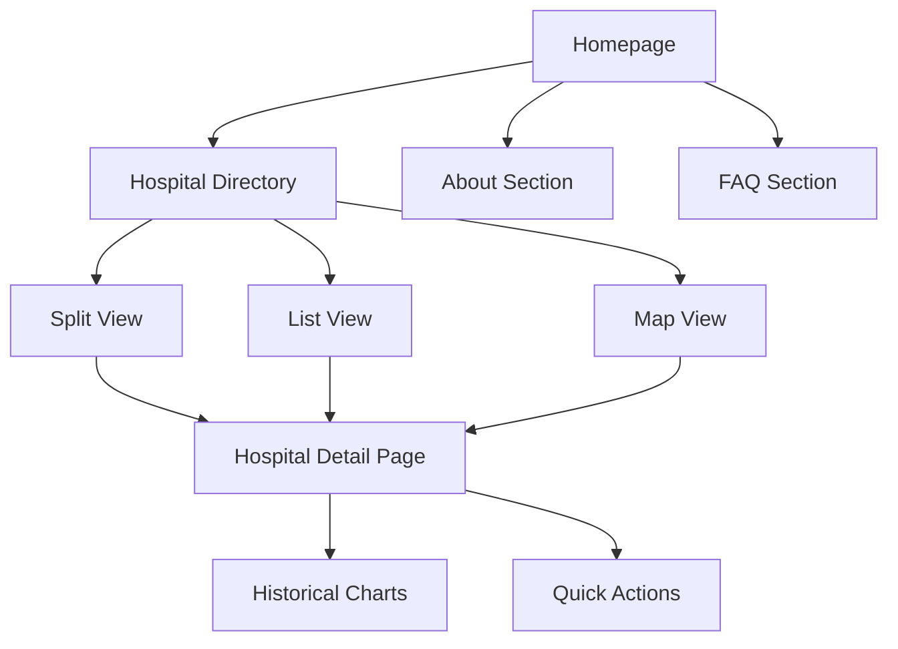

# Competitor Design Analysis & Feature Mapping

> Deep evaluation of competitor UI/UX and web design with actionable recommendations for WaitTime Canada.
>
> Historical analysis snapshot. For active implementation scope, use `docs/planning/roadmap.md`.

---

## Executive Summary

The competitor is an Ontario-focused ER wait time tracker serving 180+ hospitals with a clean, modern interface. This analysis maps their entire implementation to identify features, patterns, and design decisions that could enhance our project.

### Key Differentiators

| Aspect | Competitor | WaitTime Canada |
|--------|----------|-----------------|
| **Scope** | Ontario only (180+ hospitals) | Pan-Canadian (213+ Ontario, Quebec planned) |
| **Value Proposition** | "Find the Fastest ER" | "Clinically Defensible Health Systems Observatory" |
| **Methodology Transparency** | None visible | Full ontology documentation + divergence warnings |
| **Data Approach** | Simple aggregation | Audit + standardization layer |
| **Historical Data** | 24h/7d/30d charts | Planned (roadmap) |

---

## Website Architecture

### Site Map



### Navigation Structure

| Element | Location | Behavior |
|---------|----------|----------|
| **Logo** | Top-left | Links to homepage |
| **Hospitals** | Header tab | Active state: red background pill |
| **About** | Header tab | Scrolls to about section |
| **FAQ** | Header tab | Scrolls to FAQ section |
| **Theme Toggle** | Header right | Sun/moon icon for light/dark mode |
| **Mobile Menu** | Header right | Hamburger → full-screen drawer |

---

## Visual Design System

### Color Palette

| Color | Hex | Usage |
|-------|-----|-------|
| **Primary Red** | `#EF4444` | Wait times, CTAs, active states |
| **Success Green** | `#22C55E` | "Live" indicator, low wait times |
| **Warning Yellow/Amber** | `#F59E0B` | Medium wait times |
| **Background** | `#F8FAFC` | Page background with dot pattern |
| **Card Background** | `#FFFFFF` | Cards and modals |
| **Text Primary** | `#1F2937` | Headings |
| **Text Secondary** | `#6B7280` | Descriptions, labels |

### Typography

- **Font Family:** Sans-serif (appears to be Inter or similar)
- **Headings:** Bold (700) weights
- **Wait Times:** Extra bold, colored by severity
- **Body Text:** Regular (400) weight
- **Labels:** Medium (500) weight, uppercase for categories

### UI Components

| Component | Style |
|-----------|-------|
| **Buttons** | Rounded-full (pill), shadow, hover scale |
| **Cards** | Rounded-lg, subtle shadow, hover state |
| **Inputs** | Rounded-lg, border, focus ring |
| **Pills/Tags** | Rounded-full, small, colored backgrounds |
| **Accordions** | Full-width, chevron indicator, smooth animation |

---

## Homepage Analysis

### Hero Section

_Screenshot captured during competitor review (stored outside repo)._

**Components:**
1. **Emergency Alert Banner** (top)
   - Red background, white text
   - "Emergency? Call 911 immediately"
   - Always visible, doesn't dismiss

2. **Primary Headline**
   - "Find Your Nearest ER"
   - Secondary: "Search and compare real-time wait times across Ontario hospitals"

3. **Search Bar**
   - Placeholder: "Search by city or address..."
   - Geolocation button (target icon)
   - Filter/sort button

4. **Results Counter**
   - "42 hospitals found"
   - Dynamic based on filters

5. **View Switcher**
   - Split View | List | Map
   - Active state: underline

### Hospital Directory

**List View Card:**
```
┌─────────────────────────────────────────────────┐
│ 🟢 Georgian Bay General Hospital            ▼  │
│ 📍 Midland                                      │
│                                      3h 35m     │
│                                      wait time  │
└─────────────────────────────────────────────────┘
```

**Expanded Card:**
```
┌─────────────────────────────────────────────────┐
│ 🟢 Georgian Bay General Hospital            ▲  │
│ 📍 Midland                                      │
│                                      3h 35m     │
│                                      wait time  │
├─────────────────────────────────────────────────┤
│ Who is waiting           │ Who is in treatment  │
│ 👤 14 waiting            │ 👤 26 in treatment   │
├─────────────────────────────────────────────────┤
│ [Get Directions] [Visit Website] [Call Hospital]│
│ [          View full details →                ] │
└─────────────────────────────────────────────────┘
```

**Split View:**
- Left pane: Scrollable hospital list
- Right pane: Interactive map with markers
- Marker click syncs with list

---

## Hospital Detail Page

_Screenshot captured during competitor review (stored outside repo)._

### Layout Components

1. **Breadcrumb Navigation**
   - "← All Hospitals" back button

2. **Hospital Header**
   - Name with live indicator (green dot)
   - Location (city)
   - Last updated timestamp

3. **Primary Wait Time Card**
   - Large, colored display
   - "Xh Ym wait time"
   - Status indicator

4. **Occupancy Metrics**
   - "X patients waiting"
   - "Y patients in treatment"
   - Pills with icons

5. **Action Buttons**
   - Get Directions (primary)
   - Visit Website
   - Call Hospital
   - All with icons

6. **Historical Trend Chart**
   - Multi-line chart (3 metrics)
   - Time filter: 24h | 7d | 30d
   - Metrics: Wait Time, Patients Waiting, In Treatment

---

## About Section

_Screenshot captured during competitor review (stored outside repo)._

### Content Structure

**Header:**
- Category pill: "About Us"
- Title: "Why We Built ER Watch"
- Subtitle: Personal story about addressing ER uncertainty

**Value Propositions (3 columns):**

| Icon | Title | Description |
|------|-------|-------------|
| ❤️ | Built with Purpose | Real-time info for informed decisions |
| 👥 | Community Focused | Transparency and accessibility |
| 📈 | Driving Impact | Decrease ER overcrowding, improve timely care |

**Team Credit:**
- "Built by Ahmaad & Samsoor in Ontario"
- Small avatars with names

---

## FAQ Section

_Screenshot captured during competitor review (stored outside repo)._

### Questions Covered

1. **Can I rely on the online wait times to choose which hospital to go to?**
   - Answer emphasizes general info; prioritize professional medical advice

2. **How frequently are the wait times updated?**
   - Typically every 15 minutes

3. **What should I do if my condition isn't an emergency?**
   - Links to non-emergency alternatives

4. **Why do the wait times change so frequently?**
   - Explains unpredictable ER dynamics

5. **What do posted wait times actually mean?**
   - Time from triage to seeing a doctor

6. **Why might actual wait times differ from posted times?**
   - Triage priority, staff changes

### UI Implementation
- Clean accordion/expansion cards
- Chevron icons for expand/collapse
- Smooth CSS transitions
- Large touch targets

---

## Mobile Experience

_Screenshot captured during competitor review (stored outside repo)._

### Responsive Adaptations

| Desktop | Mobile |
|---------|--------|
| Horizontal tabs | Hamburger menu → full drawer |
| Split view (list + map) | Toggle between list OR map |
| Multi-column cards | Single column, stacked |
| Hover effects | Touch-optimized buttons |

### Mobile Navigation Drawer
- Full-screen overlay
- Close button (X)
- Large navigation items
- Search bar accessible
- Results counter visible

---

## Feature-by-Feature Comparison

### ✅ Features We Already Have

| Feature | Competitor | WaitTime Canada | Notes |
|---------|----------|-----------------|-------|
| Interactive Map | ✅ | ✅ | We use Mapbox |
| Wait Time Display | ✅ | ✅ | Color-coded |
| Emergency Banner | ✅ | ✅ | EmergencyBanner.tsx |
| Theme Toggle | ✅ | ✅ | ThemeToggle.tsx |
| View Toggle | ✅ | ✅ | ViewToggle.tsx (List/Map) |
| Hospital List | ✅ | ✅ | HospitalList.tsx |
| Trend Charts | ✅ | ✅ | TrendChart.tsx |

### ⚠️ Features We Have That They Don't

| Feature | Notes |
|---------|-------|
| **Methodology Transparency** | Our key differentiator - ontology, comparability matrix |
| **Divergence Warnings** | Alerts when comparing incompatible methodologies |
| **Multi-Province Support** | Quebec scraper ready, pan-Canadian architecture |
| **Telehealth Routing** | Province-specific 811 guidance |
| **PWA/Offline Support** | InstallPrompt.tsx, service worker |

### 🎯 Features to Consider Adopting

| Feature | Priority | Effort | Impact |
|---------|----------|--------|--------|
| **Split View** | High | Medium | Better UX for "browsing" users |
| **Expandable List Cards** | High | Medium | Compare 3-4 hospitals without page loads |
| **Occupancy Stats** | Medium | Medium | "14 waiting, 26 in treatment" context |
| **Search Autocomplete** | Medium | Low | City/address search improvements |
| **24h/7d/30d Toggle** | Medium | Low | We have trends, just need filter |
| **Quick Action Buttons** | Low | Low | "Get Directions", "Call" inline |

---

## Actionable Recommendations

### High Priority (Implement Soon)

#### 1. Split View Mode
**What:** List-map side-by-side view for desktop users
**Why:** Power users want to browse geographically while reading details
**Implementation:**
- Add `split` option to ViewToggle.tsx
- Create responsive grid layout (60% list / 40% map)
- Sync map hover with list highlight

#### 2. Expandable Hospital Cards
**What:** In-place expansion showing detailed stats without navigation
**Why:** Reduces page loads, enables quick comparison
**Implementation:**
- Add accordion behavior to HospitalList.tsx items
- Show: occupancy, last updated, quick actions
- Animate height transition

#### 3. Historical Data Time Filters
**What:** 24h / 7d / 30d toggle for trend charts
**Why:** Different use cases (real-time vs. planning)
**Implementation:**
- Add filter buttons to TrendChart.tsx
- Filter API response client-side
- Adjust x-axis labels accordingly

### Medium Priority (Add to Roadmap)

#### 4. Occupancy Context Display
**What:** "X waiting / Y in treatment" alongside wait time
**Why:** Provides velocity context (is ER clearing fast?)
**Implementation:**
- Requires backend scraper enhancement for occupancy
- Ontario Health portal may have this data
- Display as pills in hospital card

#### 5. Enhanced Search
**What:** City/address geocoding with autocomplete
**Why:** Mobile users often search by "Toronto hospitals"
**Implementation:**
- Mapbox Geocoding API integration
- Debounced input with dropdown suggestions
- Sort results by proximity

#### 6. FAQ/About Page
**What:** Dedicated informational sections
**Why:** Build trust, explain methodology
**Implementation:**
- Create `/faq` route with accordion component
- Enhance existing `/methods` page
- Add "About" section to homepage

### Low Priority (Nice to Have)

#### 7. Quick Action Buttons
**What:** "Directions", "Website", "Call" inline buttons
**Why:** Convenience for mobile users
**Implementation:**
- Add buttons to hospital popup/card
- Use `tel:` and map direction links
- Already planned in telehealth routing

#### 8. "Live Data Only" Filter
**What:** Toggle to hide stale data (>30 min old)
**Why:** Users want actionable, current info
**Implementation:**
- Client-side filter on `last_updated` field
- Visual indicator for stale hospitals
- Default behavior TBD

---

## UI/UX Patterns to Adopt

### 1. Visual Hierarchy for Urgency

**Competitor Pattern:**
- Wait time is the LARGEST element
- Color immediately communicates severity
- Timestamp provides trust context

**Recommendation:** Ensure our wait times are visually dominant with clear color coding.

### 2. Progressive Disclosure

**Competitor Pattern:**
- List cards are compact by default
- Expand to show occupancy + actions
- Full page for historical data

**Recommendation:** Implement expandable cards to reduce information overload.

### 3. Trust Signals

**Competitor Pattern:**
- "Last updated X min ago" everywhere
- Green "Live" dot indicator
- Emergency disclaimer prominently displayed

**Recommendation:** Emphasize data freshness indicators.

### 4. Mobile-First Touch Targets

**Competitor Pattern:**
- Large buttons (44px+ height)
- Full-width CTAs on mobile
- Generous padding

**Recommendation:** Audit our mobile touch targets for accessibility.

---

## Technical Implementation Notes

### Split View Architecture

```tsx
// components/SplitView.tsx
interface SplitViewProps {
  hospitals: Hospital[];
  selectedId: string | null;
  onSelect: (id: string) => void;
}

export function SplitView({ hospitals, selectedId, onSelect }: SplitViewProps) {
  return (
    <div className="grid grid-cols-5 h-[calc(100vh-200px)]">
      <div className="col-span-3 overflow-y-auto border-r">
        <HospitalList 
          hospitals={hospitals}
          selectedId={selectedId}
          onSelect={onSelect}
          expandable={true}
        />
      </div>
      <div className="col-span-2 relative">
        <Map 
          hospitals={hospitals}
          highlightedId={selectedId}
          onMarkerClick={onSelect}
        />
      </div>
    </div>
  );
}
```

### Expandable Card Pattern

```tsx
// In HospitalList.tsx
const [expandedId, setExpandedId] = useState<string | null>(null);

return hospitals.map(hospital => (
  <div 
    key={hospital.id}
    className="border rounded-lg cursor-pointer transition-all"
    onClick={() => setExpandedId(expandedId === hospital.id ? null : hospital.id)}
  >
    <CompactCard hospital={hospital} />
    {expandedId === hospital.id && (
      <ExpandedDetails hospital={hospital} />
    )}
  </div>
));
```

---

## Browser Recordings

The following recordings demonstrate the competitor's user experience:

### Homepage & Navigation Exploration
_Recording captured during competitor review (stored outside repo)._

### Feature Deep Dive (FAQ, About, Search, Mobile)
_Recording captured during competitor review (stored outside repo)._

---

## Conclusion

The competitor is a well-executed, focused tool for Ontario ER wait times. Their strengths are:
- Clean, modern UI with excellent visual hierarchy
- Progressive disclosure reducing cognitive load
- Mobile-first responsive design
- Simple, clear value proposition

**However**, WaitTime Canada has significant advantages:
- Pan-Canadian scope with multi-province architecture
- Methodology transparency (our key differentiator)
- Clinical defensibility through ontology enforcement
- Data auditing vs. simple aggregation

**Recommended Next Steps:**
1. Implement Split View for desktop users (High Impact)
2. Add expandable list cards for quick comparison (High Impact)
3. Add time filter buttons to trend charts (Low Effort)
4. Consider FAQ page using our existing methodology content
5. Audit mobile touch targets and responsive behavior

---

*Analysis completed: February 4, 2026*
*Browser exploration recordings archived in artifacts directory*
